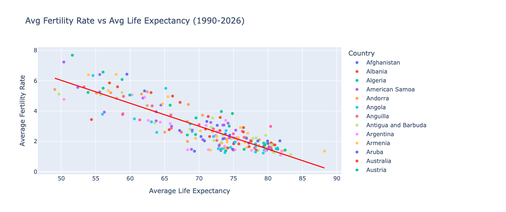
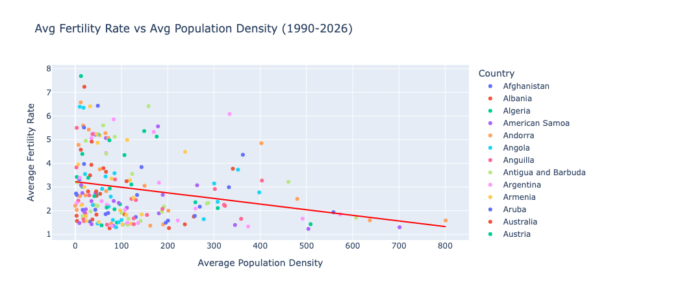
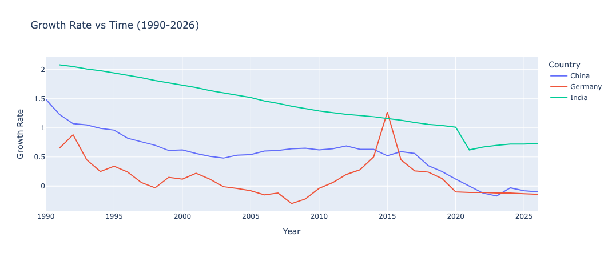
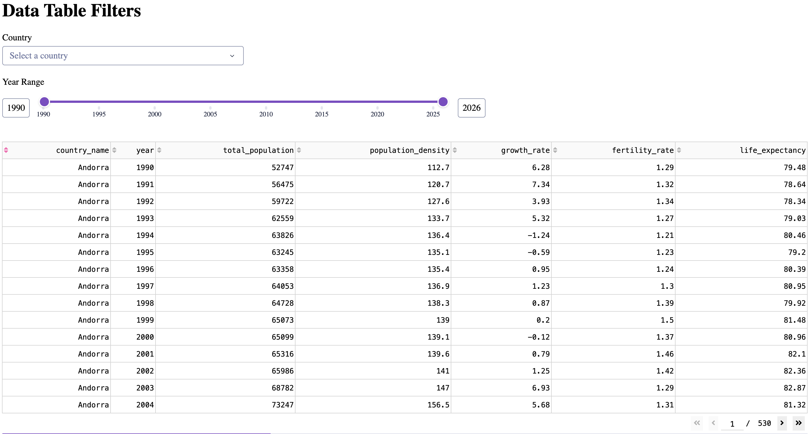
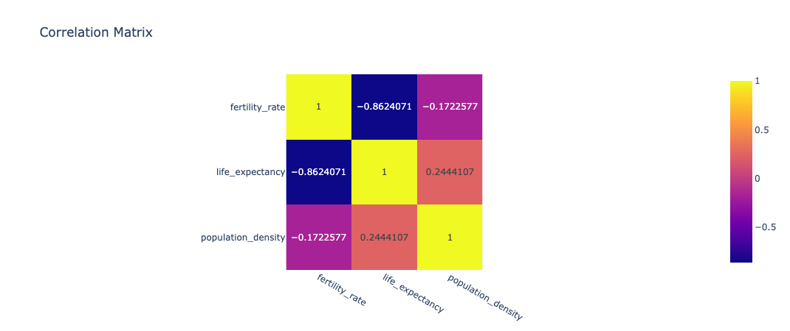

# Dev10 Midterm Final Report

**Name:** Michael Bienasz

**Date:** 5/25/2026

## Introduction

This report utilizes the U.S. Census Bureau's International Database (IDB) to analyze 
global demographic trends across 200+ countries from 1990 to 2026. The data was obtained 
from the downloadable dataset, specifically the idb5yr.txt file, which contains
population and health metrics such as fertility rates, population density, and other demographics by country and year.

The goal of this analysis was to test the following hypothesis.

**Hypothesis**

Countries that have a higher life expectancy and higher population density tend to have a lower fertility rate than countries that have a lower life expectancy and lower population density.

## Source

United States Census Bureau. (2025). *International Database (IDB): World population estimates and projections* [Data file]. U.S. Department of Commerce. https://www.census.gov/programs-surveys/international-programs/about/idb.html

## Data Preparation

After extracting the data set into my python script, the dataset was large and uncleaned. I first transformed the dataset to contain only necessary columns to support my hypothesis, which included columns such as fertility rate, population, and life expectancy.

The dataset was further transformed to be filtered from year 1990-2026, this was to focus the analysis on modern trends and to improve app performance. Null and unnecessary values were removed to load the cleaned dataset into the database for visualization and analysis.

## Discovery and Analysis

**Fertility Rates vs Life Expectancy**

The first trend I looked at was the fertility rates and life expectancy of each country, to do this I aggregated average fertility rates and life expectancies by country and created a scatter plot with a trend line.

I discovered from this visualization that there is a strong negative correlation between average fertility rate and life expectancy. As life expectancy increases, fertility rates consistently decline across countries, and the trend line confirms the downward trend. This strongly supports my hypothesis that countries with a higher life expectancy tend to have lower fertility rates.

**Fertility Rates vs Population Density**

The second trend examined the relationship between fertility rates and population density. Data was aggregated by country average and graphed using another scatter plot with a trend line. Due to outliers from micro nations and very small countries area wise, the data was filtered to countries below the 95th percentile of population density to better represent the global trend. 

Like the first graph, this visualization does show a downward trend although it is significantly weaker. We can see a very marginal negative correlation, however the data tends to be more scattered and has a large cluster in the bottom left portion. This suggests that the negative correlation is not strong enough to support my hypothesis of higher densely populated countries tend to have lower fertility rates than low densely populated countries.

**Other Visualizations**

I also incorporated other visualizations in my dataset to further explore and examine the dataset, one of them being Metrics over Time. The metrics that are able to be computed by this line graph are fertility rate, growth rate, life expectancy, and total population. The purpose of this graph is to see metrics over time (1990-2026), and allows for comparison between multiple countries using the dropdown. In addition, I have incorporated a data table with sorting, as well as year and single country filtering to represent my full cleaned dataset. 

For these visualizations, they don't really support my hypothesis with comparing average fertility rates and life expectancy/population density. But it allows for other trends to be seen in the dataset such as declining growth rates, spikes in a certain time frame, and more. These visualizations allowed for a way to explore different metrics in this large dataset.

## Correlation Matrix

In my correlation matrix, the variables I used were key metrics in the hypothesis being fertility rate, life expectancy, and population density. The heatmap represents the correlation strength with dark blue representing a strong negative correlation, purple showing zero correlation, and yellow showing a strong positive correlation. 

The matrix confirms a strong negative correlation between fertility rate and life expectancy with a value of -0.86, meaning as life expectancy increases, fertility rates consistently decrease. In addition, the correlation between fertility rate and population density is much weaker with a value of -0.17, showing that a country's population density is not nearly as strong of a predictor of fertility rate. These results are consistent with the scatter plots.

## Peer Feedback

Peer feedback took place while demoing my visualizations to my standup group (LongCheng, Dylan, Anne). One piece of feedback in my group was that there was a clear agreement with the negative correlation between fertility rates and life expectancy, and they were able to see it through my scatter plot. They suggested that I should add a trend line to my graph to further show this. I took this feedback and incorporated the trend line in both of my scatter plots to better visualize the trends. Overall, feedback was good and I took some suggestions like adding a trend line, making it more dynamic and incorporated it in when finalizing my visualizations. 

## Data Decisions

Based on the graphs and correlation matrix, the strongest basis for decision making lies in the relationship between life expectancy and fertility rate.

For countries with high fertility rate and low life expectancy, the data suggests that investing in healthcare to improve life expectancy may contribute to declining fertility rates over time. Decisions could be made for the government to improve and prioritize healthcare resources in these countries.

On the other side, countries with high life expectancy and low fertility rates could face future population decline challenges. Decisions could include policies and incentives for families to have more children to combat future population decline and a majority elderly population.

Regarding country population density, as the correlation was weak with fertility rates, it should not be used a primary factor in decision making. When assessing fertility rates, decisions should be made by prioritizing other factors like life expectancy, or it could be assessed by looking at other factors such as cost of living, urbanization for a different analysis.

